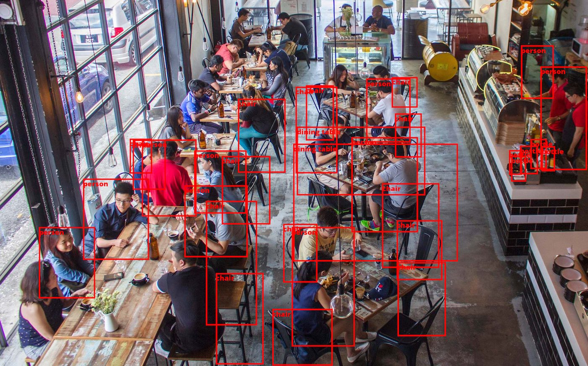

# Object Detection

Using the hugging face hustvl/yolos-tiny model to detect objects in an image and label them.


## Installation

Install python dependencies and include the font/image files.

```
pytorch
PIL
transformers
```
    
Use the included image or choose your own:
```
picture_path = "./cafe.jpg"
```

Run
```
python obj_detection.py
```

This should generate an image with lables as shown here:


